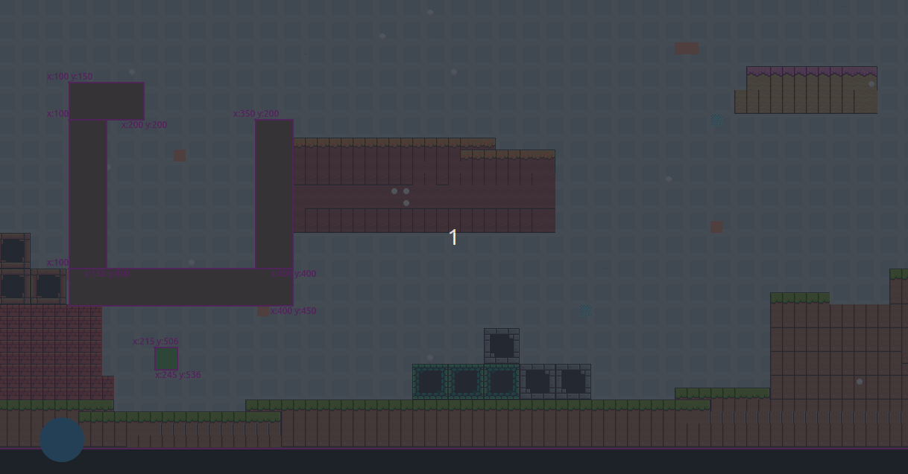

# Collision Detection with Flame Joystick

Simple 4 movement collision dectection.

With map made using tiled map editor

## Switch Between maps

## Environment

* Flame 1.2.0
* flame_tiled 1.5
* Flutter 3.0.2
* Dart 2.17.3
* Ubuntu 22.04

Developed in June 2022.

## Additional Examples of Joystick

* https://github.com/codetricity/charlie_chicken